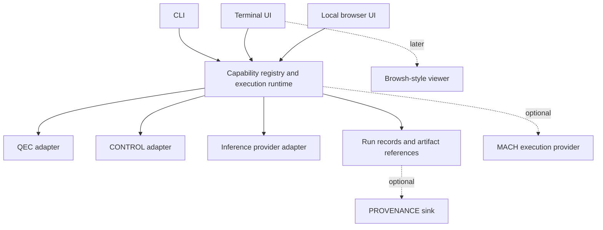

# QSOL Workbench: design assessment and executable handoff

This is Astra's dated handoff assessment. Repository import changes and current checks are recorded in [VALIDATION.md](VALIDATION.md), [SOURCE_PROVENANCE.md](SOURCE_PROVENANCE.md) and [the changelog](../CHANGELOG.md). Historical path examples below describe the original handoff layout.

**Prepared for:** Trent / QSOLKCB  
**Date:** 7 October 2026  
**Deliverable:** Research-backed report, reference implementation, validation evidence, and implementation roadmap  
**Working product name:** QSOL Workbench  
**Implementation status:** Version 0.1.0 local reference prototype

## 1. Executive recommendation

Build a reusable project workbench around **versioned capabilities and shared execution**, with terminal and browser presentations. Integrate QEC as the first real project and QSOL-CONTROL as the second. Preserve a Browsh-inspired browser viewer as an optional extension.

The central product promise should be:

> Define a supported operation once. Discover it from the running backend. Expose it consistently in the terminal and browser. Retain enough context to explain what actually ran.

The original idea combines several valuable needs: a reusable frontend, an ncurses-style operator experience, optional inference controls, a modular monorepo, and relief from maintaining a TUI separately from its backend. The largest improvement is to address their shared cause: duplicated capability definitions and unclear release/environment identity.

A browser reimplementation can display an existing web application, but it cannot repair missing backend adapters or make an installer consume unreleased source fixes. Those are separate integration and release problems. The architecture must address them explicitly.

This handoff includes working software to make the recommendation reviewable. It demonstrates the capability model, command execution, generated forms, local run records, terminal/browser presentations, a QEC parser adapter, two real CONTROL read operations, and a basic optional Ollama playground. It does not claim the full long-term platform is complete.

## 2. User intent and success criteria

### Intent retained

- One frontend that can be attached to multiple repositories.
- A terminal-first workflow with useful browser access.
- Optional richer AI inference interaction.
- A small, understandable core and explicitly bounded modules.
- A monorepo for the frontend and its integrations.
- Compatibility with existing CLI and structured-output workflows.
- Less UI maintenance when project commands change.

### Testable outcomes

1. A supported new scalar QEC parameter appears after capability refresh, without editing the frontend.
2. An unavailable backend never turns into a fabricated successful demonstration.
3. The user can identify the interpreter, backend origin and capability snapshot associated with a run.
4. A second project integrates through an adapter while the core remains unchanged.
5. Failed, cancelled, timed-out and successful operations remain distinguishable.
6. Terminal and browser submissions use the same validator and execution path.
7. Installing/updating the frontend does not imply that every backend has also been updated.

The bundled tests directly exercise outcomes 1–6 within the stated validation boundaries. Outcome 7 needs a production release process; the prototype keeps backend installation explicit.

## 3. Review method and scope

The review began with Browsh's public architecture and then examined the supplied QSOLKCB organization. Selected repositories were inspected according to relevance to interfaces, command dispatch, provenance and AI execution. This is a focused source/documentation review, not a comprehensive audit of every public repository.

For QEC, reviewed material includes the installer, Rust package and build script, main entry point, dispatch logic, UI/application structure, usage documentation, Python command registrations, benchmark parser, repository tree and latest release metadata. For CONTROL, the review includes its actual request/response schemas, CLI transport, dispatcher, machine-readable contract and documentation. RIVET, PROVENANCE and MACH were reviewed for their relevant architectural contracts and current scope.

GitHub web caches initially returned older QEC material. Current files were subsequently fetched directly and release metadata checked through the API. This report uses the newer direct source observations. In particular, the current installer already supports a source-build fallback; the older cached installer did not. Recommendations account for that existing fix.

Exact reviewed commit IDs and per-file content hashes are recorded in `evidence/sources.json`. A source snapshot establishes what was inspected, not the state of the user's installed workstation.

| Repository | Reviewed commit |
|---|---|
| QEC | `7103836d731a869dc82b077bc0b920a76072f08e` |
| RIVET | `64454066afe1de6a020a376045a7b9bea4a934c2` |
| QSOL-CONTROL | `55c3fbee6435d4a6206aa946579f36724698a20b` |
| PROVENANCE | `e801c8201e1f0eac00774362cf722798d6006f36` |
| QSOL-MACH | `d0c4017d2b2a230659a97ab8f6ecca56fb3076ed` |

## 4. QEC findings

### 4.1 Missing live adapter modules are a functional gap

The TUI dispatches requests to five Python module names: `qec.cli.diagnostics`, `qec.cli.history`, `qec.cli.invariants`, `qec.cli.phase_diagnostics` and `qec.cli.law_engine`. The reviewed repository does not supply them, and its current usage guide explicitly describes this unfinished integration. Other displayed panels are also identified as unconnected. [QEC dispatcher](https://github.com/QSOLKCB/QEC/blob/7103836d731a869dc82b077bc0b920a76072f08e/tui/src/commands.rs), [usage guide](https://github.com/QSOLKCB/QEC/blob/7103836d731a869dc82b077bc0b920a76072f08e/USAGE.md)

**Implication:** A newer-looking UI or corrected version string cannot make these operations work. The replacement should initially expose executable, tested commands and explicitly label unavailable capabilities. Do not reconstruct historical panel semantics from their names.

### 4.2 Installer revision and installed release are different

The documented curl command retrieves `tui/install.sh` from `main`. The script resolves GitHub's latest release and either downloads a matching uploaded executable or builds the source at that release tag. The release response observed during review identified `v173.0`, published 23 September 2026, with an empty uploaded asset list. [Current installer](https://github.com/QSOLKCB/QEC/blob/7103836d731a869dc82b077bc0b920a76072f08e/tui/install.sh), [published release](https://github.com/QSOLKCB/QEC/releases/tag/v173.0)

**Implication:** A fixed installer on `main` can still install older tagged TUI code. Installing the latest published release does not install the latest commit. The archive must not describe this as proof of the exact fault on Trent's machine; it is a concrete source-level explanation for an observed class of mismatch.

### 4.3 Useful repairs already exist

Current `build.rs` reads QEC's release version from `pyproject.toml`, and CI checks noninteractive probes and automatic propagation of a version change. The dispatcher also respects an explicitly configured Python interpreter and reports failures rather than silently falling back to demonstration values. [Version derivation](https://github.com/QSOLKCB/QEC/blob/7103836d731a869dc82b077bc0b920a76072f08e/tui/build.rs), [TUI checks](https://github.com/QSOLKCB/QEC/blob/7103836d731a869dc82b077bc0b920a76072f08e/.github/workflows/tui-install.yml)

**Implication:** Preserve these behaviors in the migration. The Rust crate's historical package version is not sufficient evidence that the displayed version is wrong; current code has a separate authoritative version source.

### 4.4 QEC already has usable command targets

Its package registrations include ququart/qutrit demonstrations and batteries, report validation, bridge operations and routing commands. The ququart benchmark module has a callable argparse parser and emits a JSON manifest after execution. That makes it a practical first integration with a bounded purpose. [Command registrations](https://github.com/QSOLKCB/QEC/blob/7103836d731a869dc82b077bc0b920a76072f08e/pyproject.toml), [benchmark CLI](https://github.com/QSOLKCB/QEC/blob/7103836d731a869dc82b077bc0b920a76072f08e/src/qec/benchmark/ququart_battery/cli.py)

**Implication:** Start with a real benchmark-to-artifact workflow. Generalize only after a second backend works. Keep QEC's scientific validation and artifact semantics in QEC.

## 5. Existing QSOL foundations

### RIVET: separate commands from presentation

RIVET's UI contract binds menus and key events to existing command IDs. The command remains meaningful independently of whether a menu is displayed. This directly supports the workbench's key design rule. Its reviewed UI v1 scope is intentionally limited; it does not provide a general widget toolkit or command palette. [RIVET UI v1](https://github.com/QSOLKCB/RIVET/blob/64454066afe1de6a020a376045a7b9bea4a934c2/UI-v1.md)

**Recommendation:** Adopt the separation principle immediately. Evaluate a RIVET presentation adapter later against concrete needs such as editable forms, long logs, Unicode and accessibility. Do not make core delivery wait for a new renderer.

### QSOL-CONTROL: an existing shared machine interface

CONTROL already specifies local JSONL requests, capability discovery and shared underlying runtime behavior for web and machine clients. Its contract includes a wider catalog than this prototype exposes. [CONTROL machine contract](https://github.com/QSOLKCB/QSOL-CONTROL/blob/55c3fbee6435d4a6206aa946579f36724698a20b/ai/agent-api-contract.json)

**Recommendation:** Integrate through this existing API. The handoff exposes health and capability inspection. Later add run inspection/comparison with explicit parameter mapping. Retain existing operational boundaries when adding mutations; capability discovery by itself does not grant additional authority.

### PROVENANCE: recording observations without redefining project semantics

PROVENANCE documents generic HTTP and local-process adapters that retain observed input/output bytes and distinguish declared metadata from observed or derived evidence. [Adapter contract](https://github.com/QSOLKCB/PROVENANCE/blob/e801c8201e1f0eac00774362cf722798d6006f36/docs/ADAPTERS.md)

**Recommendation:** Make it an optional recording sink. The workbench's simple JSON records are useful operational history, but they are not a substitute for PROVENANCE's evidence model. A connector should translate records carefully and preserve failures.

### QSOL-MACH: optional agent execution

MACH's reviewed Phase 0 scope includes typed actions, validation, execution receipts and bounded trajectory tracking. It is not an inference server, and provider/transport adapters are planned for later phases. [MACH scope](https://github.com/QSOLKCB/QSOL-MACH/blob/d0c4017d2b2a230659a97ab8f6ecca56fb3076ed/README.md)

**Recommendation:** Treat MACH as an optional future execution provider. Keep model-serving integration separately replaceable. Avoid claiming production readiness or performance advantages that this review did not measure.

## 6. Browsh assessment and alternatives

Browsh delegates page execution to headless Firefox and uses a browser extension to transform output for a character-cell display. That is valuable when the goal is to interact with existing web applications from a terminal. It also introduces a browser lifecycle, extension integration and rendering adaptation. [Browsh architecture](https://www.brow.sh/docs/introduction/)

For this project, the controlled domain is commands, input forms, job state and artifacts. These already have semantics that can be expressed directly. Reconstructing those semantics from rendered pages would add complexity without repairing backend contracts.

| Approach | Benefit | Main cost | Decision |
|---|---|---|---|
| Browsh-derived application | Access existing arbitrary web applications | Browser/extension/rendering work, coupled interaction semantics | Optional future viewer |
| Separate handwritten TUI and web apps | Full design freedom | Repeated action definitions and validation drift | Avoid duplicated domain definitions |
| One terminal app served in a browser | Quick initial UI reuse | Limited fit for richer browser workflows | Viable alternative for a narrower product |
| Shared capabilities/runtime, separate presentations | Backend reuse plus suitable interfaces | Maintain two small presentation layers | Recommended architecture |
| RIVET as immediate sole renderer | Strong capability philosophy | Additional UI evaluation and integration work | Evaluate after workflow proof |

Textual was considered because it can run Python terminal interfaces and expose them in a browser. It remains a plausible implementation option. The selected prototype uses standard-library curses and a small native browser UI to reduce setup requirements and make the underlying protocol easy to inspect. [Textual](https://textual.textualize.io/), [textual-serve](https://github.com/Textualize/textual-serve)

## 7. Target architecture



### Shared core responsibilities

The core owns discovery results, input validation, operation identity, execution lifecycle, output capture, record storage and frontend transport. It must not absorb scientific models, council semantics, inference kernels or arbitrary project business logic.

### Adapter responsibilities

An adapter identifies its backend, reports supported operations, maps values to argv or protocol messages, and interprets transport outcomes. It preserves backend behavior and labels unavailable connections clearly. A capability contract contains semantics; it should not deliver executable plugin code from an untrusted remote source.

### Presentation responsibilities

The TUI and web UI display connection status, build supported input forms, submit the same action ID and parameters, and inspect the same records. Custom screens may optimize common workflows, but a generic form remains available for ordinary new fields. A frontend must not invent a backend's capabilities from a roadmap or marketing description.

### Semantic compatibility

Automatic exposure works for input types the frontend already understands. New scalar fields are feasible; new interaction models, custom converters, streaming structures or authorization semantics may need adapter/frontend changes. Version negotiation should reject unsupported major protocols, and capability fingerprints should prevent an old form being submitted after discovery changes.

The reference implementation uses a small `qsol-workbench/1` contract rather than claiming full JSON Schema or OpenAPI support. OpenAPI can later supply operation schemas for HTTP projects; it is not a requirement for local CLI integration. [OpenAPI specification](https://spec.openapis.org/oas/latest.html)

## 8. Monorepo and module strategy

Keep the frontend, shared protocol, adapters, optional presentation modules, tests and documentation together. Keep project engines in their existing repositories. Early modules can be directories in one package; separate publishing and dependency graphs should follow demonstrated needs.

The reference tree is intentionally small:

```text
src/qsol_workbench/
  model.py              # capability contract and validation
  runtime.py            # shared jobs and records
  process.py            # subprocess execution
  adapters/builtin.py   # explicit integrations
  worker.py             # isolated adapter helpers
  cli.py / tui.py       # terminal presentations
  web.py / static/      # browser presentation
tests/
docs/
examples/
evidence/
```

Split `builtin.py` into separate adapter modules once their size or dependencies justify it. Add a stable external adapter protocol before considering an unrestricted plugin loader. An out-of-process adapter gives a clearer failure/dependency boundary than loading every project inside the frontend interpreter.

## 9. Delivered implementation and design tradeoffs

### Why Python for this handoff

The earlier discussion favored evaluating reuse of QEC's existing Rust/Ratatui work. That remains a production option. This implementation is a reference baseline in Python because it can be run immediately with the available interpreter, exposes the architecture with few setup steps, and keeps optional backends in separate processes. It is not a Rust implementation or a demonstrated performance comparison.

A later decision should measure startup time, idle memory, rendering responsiveness, distribution size and maintenance complexity. If Rust is chosen, preserve the protocol and acceptance corpus, then replace one runtime or presentation layer at a time. Avoid rewriting the working design before the interfaces stabilize.

### Delivered features

| Feature | Status |
|---|---|
| Capability listing and connection diagnostics | Implemented |
| Strict supported-field validation | Implemented |
| CLI, curses TUI and local web forms | Implemented |
| Async local jobs, progress capture, timeout and cancellation | Implemented |
| Local JSON records and export | Implemented |
| QEC ququart parser discovery and argv execution | Implemented; fixture-tested |
| CONTROL discovery and health | Implemented; real-source smoke-tested |
| Ollama model discovery and prompt streaming | Implemented; HTTP-fixture-tested |
| Browser parameter presets | Implemented |
| Multi-turn AI chat, RAG, files and tools | Planned |
| QEC's missing historical diagnostic adapters | Unimplemented in this handoff |
| Browsh embedding, RIVET renderer, MACH and PROVENANCE integration | Planned |
| Persistent jobs surviving UI shutdown | Planned |
| Remote multi-user deployment and plugin marketplace | Outside initial scope |

### Honest operational limits

The server is intended for one local operator. No remote hosting interface is exposed. Configured local backends are trusted code running with the operator's permissions. Local web API protections reduce accidental cross-site invocation; they do not sandbox a configured Python environment.

Jobs are session-owned. A graceful close cancels them, while abrupt termination can leave incomplete records. Captured output is bounded. QEC may write artifacts outside the workbench store according to its own output parameter. Cancellation stops local processes but cannot undo writes already performed; disconnecting an inference stream does not certify provider-side cancellation.

Run hashes provide a reproducible checksum of record content under the implemented serialization rules. They neither certify factual correctness nor establish signed chain-of-custody or exact replay. Backend and dependency changes can affect reruns even when recorded inputs match.

## 10. Release and installation strategy

Use independent version identities for the workbench, adapters, backend protocol and connected project. Display them as separate facts. A shared release number creates a false expectation that every installed component is identical.

For production distribution:

1. Build artifacts from an immutable workbench release commit.
2. Publish a release manifest containing platform, artifact hash and supported protocol ranges.
3. Verify the exact uploaded artifact through install, noninteractive version/help, discovery and a demo run.
4. Test representative compatible backend versions and publish the tested matrix.
5. Make development-checkout installation an explicit channel with a recorded commit.
6. Fail clearly when a selected release has no artifact or incompatible backend, rather than silently choosing unrelated versions.

A backend's advertised capabilities should be tied to the installation actually executing requests. Runtime discovery reduces UI drift; it does not guarantee an environment is current. An explicit diagnostic command should print resolved paths and version/source identities before suggesting an update.

## 11. Delivery sequence and acceptance gates

The detailed task plan is in `docs/IMPLEMENTATION_PLAN.md`. Recommended sequence:

1. Validate this handoff and choose the first supported operating environment.
2. Run the QEC adapter against a real prepared QEC environment; retain a benchmark manifest and validation evidence.
3. Add backend-owned command descriptors for the next two real QEC operations.
4. Extend CONTROL read workflows without changing the shared core.
5. Decide Python versus Rust using measured requirements.
6. Harden release artifacts, connection identity and interrupted-job behavior.
7. Expand the AI module according to actual workflow demand.
8. Add provenance and browser/native-renderer extensions only when their contracts are concrete.

The decisive platform acceptance test remains: a compatible backend option is added, capability refresh discovers it, both presentations render it, and a submitted run demonstrably receives the value without a UI source edit.

## 12. Risks, mitigations and decisions still needed

| Risk | Consequence | Mitigation / acceptance evidence |
|---|---|---|
| Manually duplicated adapter fields | TUI drift reappears inside adapters | Derive schemas from backend-owned declarations; schema-change test |
| Treating planned capabilities as executable | Convincing but nonfunctional screens | Advertise only tested operations; explicit unavailable state |
| Building a browser engine too early | Main workflow blocked by rendering work | Keep browsing optional and demonstrate one required browser use case first |
| Generic forms become awkward | Operators avoid the workbench | Add focused custom views while retaining a complete generic fallback |
| Release/tag/environment mismatch | Repeated version confusion | Report exact identities; test installed release artifacts |
| Record collection grows without limits | Memory/disk pressure | Output bounds now; retention and streaming storage before long-lived service use |
| UI exits during long work | Interrupted jobs or unclear status | Session-owned behavior now; evaluate a persistent runner later |
| AI output presented as evidence | Misinterpretation of generated content | Retain provider identity and distinguish observations from assertions |
| In-process plugin loading | Dependency and failure coupling | Start with explicit adapters and subprocess boundaries |

Product decisions still needed are the primary distribution platform, whether arbitrary web browsing is a must-have, the preferred production language, the first AI backend/workflow, and whether jobs must survive frontend restarts. None prevented creation of the bounded reference implementation. Linux, local execution, an optional external Ollama server and session-owned jobs are the explicit defaults here.

No defensible calendar estimate can be derived from a source review alone. Use the milestone gates and measure the first real integration before committing dates. The broad browser rewrite would be the largest uncertainty; the bounded QEC/CONTROL adapter path has the clearest near-term validation.

## 13. Recommended next action

Run the bundled demo and review the actual source. Then connect a prepared QEC environment and complete one benchmark-to-manifest workflow before expanding the framework. Use CONTROL as the independent second backend to ensure the abstraction serves multiple projects.

The resulting product can become a consistent operating surface across the QSOL ecosystem while keeping project semantics, optional AI execution and richer rendering independently maintainable.

## 14. Evidence and source navigation

- `evidence/sources.json`: source URLs, snapshot commits and reviewed file hashes.
- `evidence/validation.json`: machine-readable validation summary.
- `evidence/unit-tests.txt`: test run transcript.
- `evidence/control-live-run.json`: actual CONTROL health run from the inspected snapshot.
- `evidence/demo-run.json`: actual demo result.
- `evidence/browser.png`: browser acceptance screenshot.
- `docs/VALIDATION.md`: what was tested and what remains unverified.

Source links in this report support repository/technology observations. Architecture recommendations, delivery choices and proposed acceptance gates are engineering judgments made for this task.
